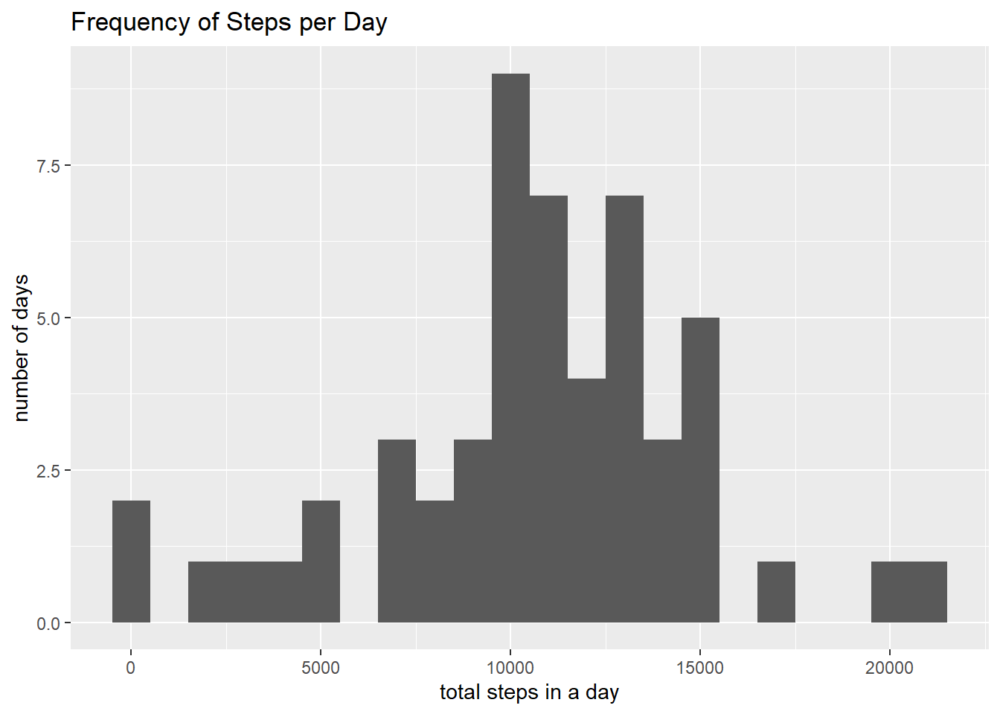
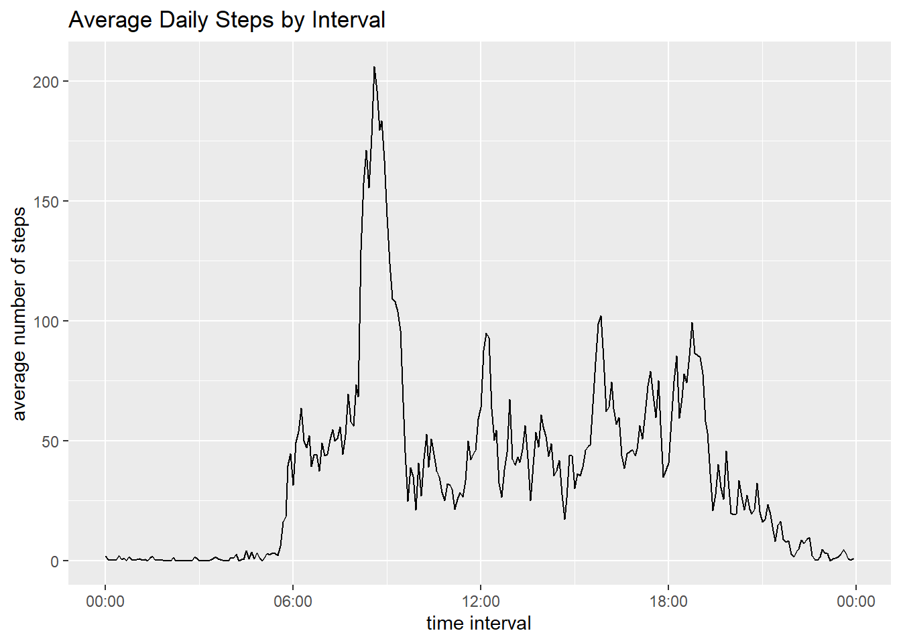
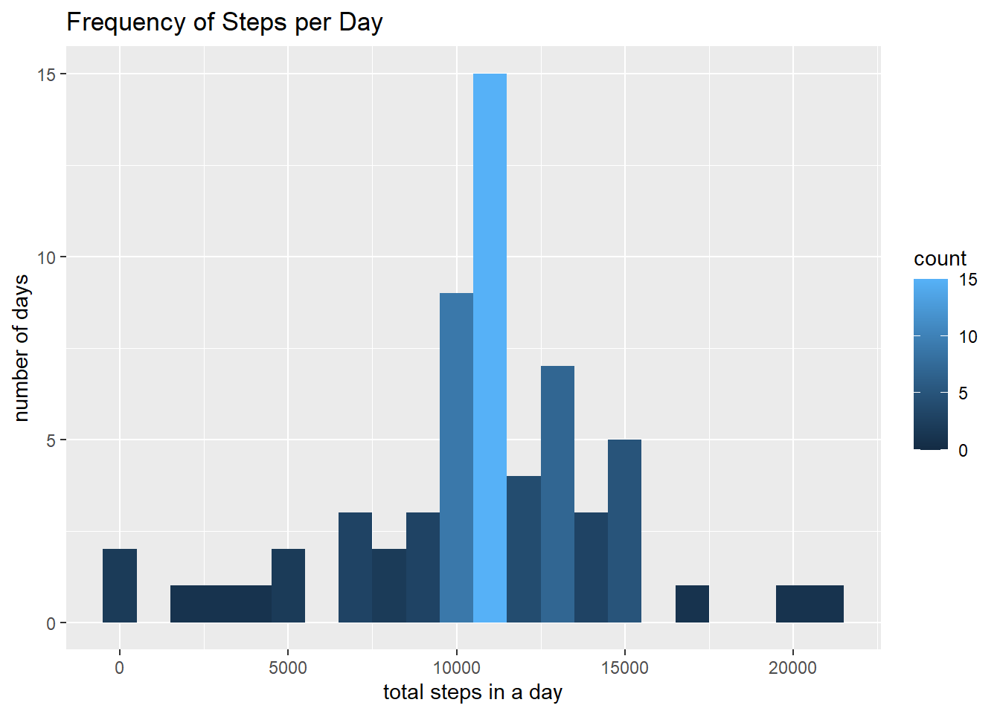
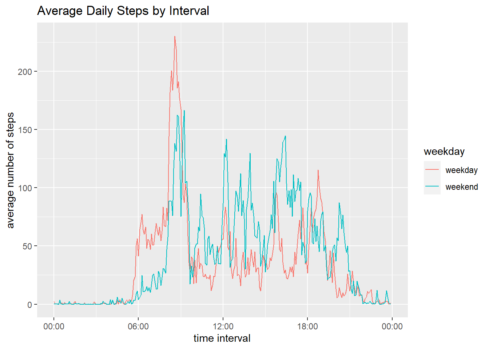

```r
knitr::opts_chunk$set(echo = TRUE, warning = FALSE, fig.path = "figure/fig-")
```

## Load required packages

```r
library(ggplot2)
library(scales)
```

## Loading and preprocessing the data
1. Loading the data.
    
    ```r
    steps <- read.csv(unz("activity.zip", "activity.csv"))
    ```

2. Processing the data.
    
    ```r
    steps$date <- as.Date(steps$date)
    steps$interval <- sprintf("%04d", steps$interval)
    steps$datetime <- as.POSIXct(paste(steps$date, steps$interval), format = "%Y-%m-%d %H%M", tz = "EST")
    ```

## What is mean total number of steps taken per day?
1. Calculating the total number of steps taken per day.
    
    ```r
    steps.bydate <- split(steps, steps$date)
    steps.bydate.sum <- sapply(steps.bydate, function(x) sum(x$steps))
    steps.bydate.sum <- stack(steps.bydate.sum)
    ```

2. Plotting a histogram of the the total number of steps taken each day.
    
    ```r
    ggplot(steps.bydate.sum, aes(values)) +
        geom_histogram(binwidth = 1000) +
        labs(x = "total steps in a day", y = "number of days", title = "Frequency of Steps per Day") +
        scale_fill_brewer(palette = "Blues")
    ```
    
    <!-- -->

3. Calculating the mean and median of the total number of steps taken per day.
    
    ```r
    steps.bydate.mean <- mean(steps.bydate.sum$values, na.rm = TRUE)
    steps.bydate.median <- median(steps.bydate.sum$values, na.rm = TRUE)
    ```
    The total number of steps taken per day has a mean of 1.0766189\times 10^{4} and a median of 10765.

## What is the average daily activity pattern?
1. Plotting time interval and average number of steps taken, averaged across all days.
    
    ```r
    steps.byinterval <- split(steps, steps$interval)
    steps.byinterval.mean <- sapply(steps.byinterval, function(x) mean(x$steps, na.rm = TRUE))
    steps.byinterval.mean.df <- stack(steps.byinterval.mean)
    
    ggplot(steps.byinterval.mean.df, aes(steps$datetime[1:288], y = values)) +
        geom_path() +
        labs(x = "time interval", y = "average number of steps", title = "Average Daily Steps by Interval") +
        scale_x_datetime(labels = date_format("%H:%M", tz = "EST"))
    ```
    
    <!-- -->

2. Calculating which 5-minute interval, on average across all the days in the dataset, contains the maximum number of steps.
    
    ```r
    max.steps <- sort(steps.byinterval.mean, decreasing = TRUE)[1]
    max.interval <- names(sort(steps.byinterval.mean, decreasing = TRUE))[1]
    ```
    On average, the max number of steps is 206.1698113 taken within the 0835 5-minute interval.

## Imputing missing values
1. Calculating the total number of missing values in the dataset.
    
    ```r
    missing.total <- sum(missing.steps <- is.na(steps$steps))
    ```
    The total number of missing step values in the dataset is 2304.  

2. Devising a strategy for filling in all of the missing values in the dataset.  
    All missing step values will be replaced with the mean step value for that 5-minute interval.

3. Creating a new dataset with missing step values filled in.
    
    ```r
    steps$steps.mean <- steps.byinterval.mean
    for(i in seq(nrow(steps))) {
        steps$steps.filled[i] <- ifelse(steps$steps[i] %in% NA, steps$steps.mean[i], steps$steps[i])
    }
    steps.filled.bydate <- split(steps, steps$date)
    steps.filled.bydate.sum <- sapply(steps.filled.bydate, function(x) sum(x$steps.filled))
    steps.filled.bydate.sum <- stack(steps.filled.bydate.sum)
    ```

4. Plotting a histogram of the total number of steps taken per day and calculating the mean and median  total number of steps taken per day.
    
    ```r
    ggplot(steps.filled.bydate.sum, aes(values)) +
        geom_histogram(binwidth = 1000, aes(fill = ..count..)) +
        labs(x = "total steps in a day", y = "number of days", title = "Frequency of Steps per Day")
    ```
    
    <!-- -->
    
    ```r
    steps.filled.bydate.mean <- mean(steps.filled.bydate.sum$values, na.rm = TRUE)
    steps.filled.bydate.median <- median(steps.filled.bydate.sum$values, na.rm = TRUE)
    ```
    Based on the dataset with imputed missing values, the total number of steps taken per day has a mean of 1.0766189\times 10^{4} and a median of 1.0766189\times 10^{4}.  
    These values are roughly the same as calculated before using the original data. There does not seem to be any impact from filling in the missing step values with mean data.

## Are there differences in activity patterns between weekdays and weekends?
1. Creating a new factor variable in the dataset with two levels – “weekday” and “weekend” indicating whether a given date is a weekday or weekend day.
    
    ```r
    steps$weekday <- as.factor(ifelse(weekdays(steps$date) %in% c("Saturday", "Sunday"), "weekend", "weekday"))
    ```

2. Plotting the 5-minute interval (x-axis) and the average number of steps taken, averaged across all weekday days and weekend days (y-axis).
    
    ```r
    steps.byweekday <- split(steps, steps$weekday)
    steps.byweekday.byinterval <- lapply(steps.byweekday, function(x) split(x, x$interval))
    steps.weekend <- steps.byweekday.byinterval[["weekend"]]
    steps.weekday <- steps.byweekday.byinterval[["weekday"]]
    
    steps.weekend.mean <- sapply(steps.weekend, function(x) mean(x$steps.filled, na.rm = TRUE))
    steps.weekday.mean <- sapply(steps.weekday, function(x) mean(x$steps.filled, na.rm = TRUE))
    
    steps.weekend.mean <- data.frame(time = steps$datetime[1:288], steps.mean = steps.weekend.mean, weekday = "weekend")
    steps.weekday.mean <- data.frame(time = steps$datetime[1:288], steps.mean = steps.weekday.mean, weekday = "weekday")
    steps.byweekday.mean <- rbind(steps.weekday.mean, steps.weekend.mean)
    
    ggplot(steps.byweekday.mean, aes(x = time, y = steps.mean, group = weekday)) +
        geom_path(aes(color = weekday)) +
        labs(x = "time interval", y = "average number of steps", title = "Average Daily Steps by Interval") +
        scale_x_datetime(labels = date_format("%H:%M", tz = "EST"))
    ```
    
    <!-- -->
